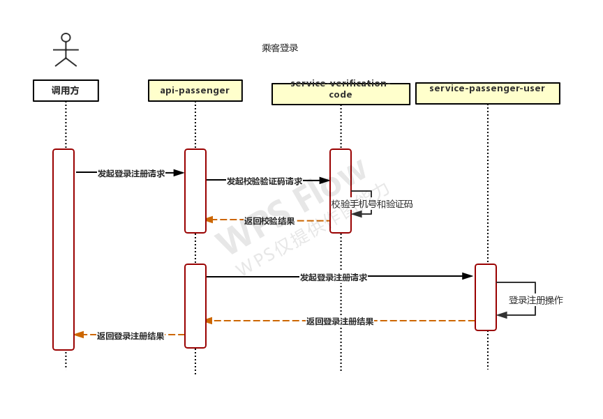
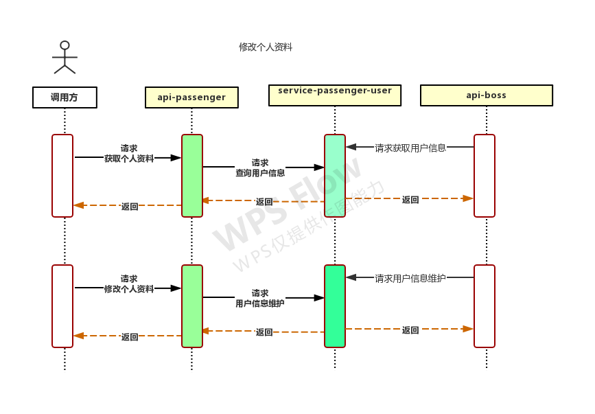

# OnlineTaxi
### 服务拆分

#### 业务层

| 模块     | 项目名           | 描述     |
| -------- | ---------------- | -------- |
| 乘客端   | api-passenger    | 乘客端   |
| 司机端   | api-driver       | 司机端   |
| 司机听单 | api-listen-order | 司机听单 |

#### 能力层

| 模块         | 项目名                    |
| ------------ | ------------------------- |
| 订单         | service-order             |
| 派单         | service-order-dispatch    |
| 乘客用户管理 | service-passenger-user    |
| 短信         | service-sms               |
| 计价         | service-valuation         |
| 验证码       | service-verification-code |
| 钱包         | service-wallet            |
| 支付         | service-payment           |
| 地图         | service-map               |

#### Spring Cloud 组件

| 模块     | 项目名                  |
| -------- | ----------------------- |
| 注册中心 | cloud-eureka            |
| 配置中心 | cloud-config-server     |
| 网关     | cloud-zuul              |
| 熔断监控 | cloud-hystrix-dashboard |
| 健康检查 | cloud-admin             |
| 链路追踪 | cloud-zipkin-ui         |

#### 基础common

所有服务都引用的一个 二方库。

| 模块                    | 项目名          |
| ----------------------- | --------------- |
| 通用，工具类,异常，校验 | internal-common |
|                         |                 |

### 时序图

#### 登录注册

#### 验证码

#### 司机端

#### 订单

#### 信息修改

#### 信息维护

### 项目演示

#### 派单 / 接单

#### 到达约定地点

#### 接到乘客

#### 开始行程

#### 到达目的地

#### 发起收款

#### 收到

