<div align="center">

# Rydr

**A Microservices-Based Ride-Hailing Platform Built with Spring Cloud**

[](https://www.oracle.com/java/)
[](https://spring.io/projects/spring-boot)
[](https://spring.io/projects/spring-cloud)
[](LICENSE)
[](CONTRIBUTING.md)

[Architecture](#architecture) | [Quick Start](#getting-started) | [Modules](#service-breakdown) | [Docs](docs/) | [Contributing](CONTRIBUTING.md)

</div>

---

## Table of Contents

- [Overview](#overview)
- [Architecture](#architecture)
- [Service Breakdown](#service-breakdown)
- [Tech Stack](#tech-stack)
- [Prerequisites](#prerequisites)
- [Getting Started](#getting-started)
- [Service Ports](#service-ports)
- [Project Structure](#project-structure)
- [Sequence Diagrams](#sequence-diagrams)
- [Demo Screenshots](#demo-screenshots)
- [Security Notes](#security-notes)
- [Contributing](#contributing)
- [License](#license)

## Overview

Rydr is a complete online taxi ordering system demonstrating enterprise-grade **Spring Cloud microservices architecture**. The platform supports the full ride-hailing workflow:

- **Passenger**: Registration, ride ordering, real-time tracking, payment
- **Driver**: Order listening, acceptance, dispatch, income tracking
- **Platform**: Pricing engine, SMS notifications, order management, monitoring

> This project serves as a comprehensive reference for building microservices-based applications with Spring Cloud.

## Architecture

The system follows a **three-layer microservices architecture**:

```
┌──────────────────────────────────────────────────────────────┐
│                   API Gateway (Zuul :9100)                    │
├──────────────┬───────────────┬───────────────────────────────┤
│ api-passenger│   api-driver  │      api-listen-order         │  ← API Layer
│    :9011     │  :9002-9003   │          :8084                │
├──────────────┴───────────────┴───────────────────────────────┤
│  service-order  │ service-sms │ service-valuation │ ...      │  ← Service Layer
│    :8004-8005   │  :8002-8003 │    :8060-8061     │          │
├──────────────────────────────────────────────────────────────┤
│  Eureka :7900 │ Config :6001 │ Admin :6010 │ Zipkin :9411   │  ← Infrastructure
└──────────────────────────────────────────────────────────────┘
         │              │              │              │
    ┌────┴────┐    ┌────┴────┐   ┌────┴────┐   ┌────┴────┐
    │  MySQL  │    │  Redis  │   │RabbitMQ │   │ActiveMQ │
    └─────────┘    └─────────┘   └─────────┘   └─────────┘
```

### Communication Patterns

| Pattern | Technology | Use Case |
|---------|-----------|----------|
| Declarative HTTP | OpenFeign + Hystrix | api-passenger → service-valuation |
| Load-balanced HTTP | RestTemplate + Ribbon | api-driver → service-sms |
| Service Discovery | Netflix Eureka | All services register and discover |
| Real-time Push | WebSocket | Driver order listening |
| Async Messaging | ActiveMQ (JMS) | Background task processing |
| Config Refresh | RabbitMQ (Spring Cloud Bus) | Dynamic configuration updates |

## Service Breakdown

### API Layer (Client-Facing)

| Module | Project Name | Port | Description |
|--------|-------------|------|-------------|
| Passenger API | `api-passenger` | 9011 | Passenger-facing endpoints (orders, auth, profile) |
| Driver API | `api-driver` | 9002-9003 | Driver-facing endpoints (grab orders, status) |
| Order Listener | `api-listen-order` | 8084 | Real-time order events via WebSocket |

### Service Layer (Business Logic)

| Module | Project Name | Port | Description |
|--------|-------------|------|-------------|
| Order | `service-order` | 8004-8005 | Order lifecycle & distributed locking |
| Dispatch | `service-order-dispatch` | 8005 | Driver-order matching algorithm |
| Passenger | `service-passenger-user` | 8012 | Registration, profiles, addresses |
| SMS | `service-sms` | 8002-8003 | SMS notification delivery |
| Valuation | `service-valuation` | 8060-8061 | Ride pricing & fare calculation |
| Verification | `service-verification-code` | 8011 | Login verification codes |
| Wallet | `service-wallet` | 8006 | Balance management |

### Infrastructure

| Module | Project Name | Port | Description |
|--------|-------------|------|-------------|
| Service Registry | `eureka` | 7900 | Netflix Eureka |
| Config Server | `rydr-config-server` | 6001 | Centralized configuration |
| API Gateway | `rydr-zuul` | 9100 | Zuul routing & filtering |
| Circuit Breaker | `hystrix-dashboard` | 6101 | Hystrix monitoring |
| Admin Monitor | `cloud-admin` | 6010 | Spring Boot Admin |

### Shared Library

| Module | Project Name | Description |
|--------|-------------|-------------|
| Common | `rydr-common` | DTOs, constants, JWT utilities, validation |

## Tech Stack

| Category | Technology |
|----------|-----------|
| **Framework** | Spring Boot 2.1.7 + Spring Cloud Greenwich |
| **Service Discovery** | Netflix Eureka |
| **API Gateway** | Netflix Zuul |
| **Load Balancing** | Netflix Ribbon |
| **Circuit Breaker** | Netflix Hystrix |
| **Inter-Service Calls** | OpenFeign |
| **Database** | MySQL 5.7+ with Druid Connection Pool |
| **ORM** | MyBatis |
| **Caching** | Redis (with Sentinel support) |
| **Messaging** | ActiveMQ (JMS) |
| **Config Management** | Spring Cloud Config + RabbitMQ Bus |
| **Distributed Tracing** | Spring Cloud Sleuth + Zipkin |
| **Authentication** | JWT |
| **Real-time** | WebSocket |
| **Build Tool** | Maven 3.x |

## Prerequisites

- **Java** 8+
- **Maven** 3.x
- **MySQL** 5.7+
- **Redis** 4.0+
- ActiveMQ *(optional, for JMS features)*
- RabbitMQ *(optional, for config bus)*

## Getting Started

### 1. Clone the Repository

```bash
git clone https://github.com/OiPunk/Rydr.git
cd Rydr
```

### 2. Configure Environment Variables

```bash
cp .env.example .env
# Edit .env with your values
```

Key variables:

| Variable | Description | Default |
|----------|------------|---------|
| `DB_HOST` | MySQL host | `localhost` |
| `DB_PORT` | MySQL port | `3306` |
| `DB_USER` | MySQL username | `root` |
| `DB_PASSWORD` | MySQL password | `changeme` |
| `REDIS_HOST` | Redis host | `127.0.0.1` |
| `EUREKA_USER` | Eureka auth username | `admin` |
| `EUREKA_PASSWORD` | Eureka auth password | `changeme` |
| `JWT_SECRET` | JWT signing secret | *(generate one)* |

> See [`.env.example`](.env.example) for the full list of configurable variables.

### 3. Initialize the Database

```bash
mysql -u root -p < rydr-sql.sql
```

The SQL file creates **108 tables** covering orders, passengers, drivers, payments, configuration, and more.

### 4. Start Services (in order)

```bash
# 1. Service Registry
cd rydr/eureka && mvn spring-boot:run -Dspring.profiles.active=7900

# 2. Config Server (optional)
cd rydr/rydr-config-server && mvn spring-boot:run

# 3. Business Services
cd rydr/service-passenger-user && mvn spring-boot:run
cd rydr/service-sms && mvn spring-boot:run -Dspring.profiles.active=8002
cd rydr/service-verification-code && mvn spring-boot:run
cd rydr/service-order && mvn spring-boot:run -Dspring.profiles.active=8004
cd rydr/service-valuation && mvn spring-boot:run -Dspring.profiles.active=8060

# 4. API Layer
cd rydr/api-passenger && mvn spring-boot:run
cd rydr/api-driver && mvn spring-boot:run -Dspring.profiles.active=9002

# 5. API Gateway
cd rydr/rydr-zuul && mvn spring-boot:run
```

### Service Ports

| Service | Port(s) |
|---------|---------|
| Eureka Registry | 7900 |
| Config Server | 6001 |
| Cloud Admin | 6010 |
| API Gateway (Zuul) | 9100 |
| API Passenger | 9011 |
| API Driver | 9002, 9003 |
| API Listen Order | 8084 |
| Service Passenger User | 8012 |
| Service SMS | 8002, 8003 |
| Service Order | 8004, 8005 |
| Service Valuation | 8060, 8061 |
| Service Verification | 8011 |
| Service Wallet | 8006 |
| Service Order Dispatch | 8005 |
| Demo App | 8083 |
| Hystrix Dashboard | 6101 |

## Project Structure

```
Rydr/
├── rydr/                        # Maven parent project
│   ├── api-driver/                     # Driver API
│   ├── api-listen-order/               # Order listener API
│   ├── api-passenger/                  # Passenger API
│   ├── cloud-admin/                    # Spring Boot Admin
│   ├── config-client/                  # Config client example
│   ├── config-client-diy/              # Custom config client
│   ├── eureka/                         # Eureka service registry
│   ├── hystrix-dashboard/              # Hystrix dashboard
│   ├── rydr-common/             # Shared library
│   ├── rydr-config-server/      # Config server
│   ├── rydr-demo-app/           # Demo application
│   ├── rydr-zuul/               # API gateway
│   ├── service-jms-consumer/           # JMS consumer example
│   ├── service-jms-produce/            # JMS producer example
│   ├── service-order/                  # Order service
│   ├── service-order-dispatch/         # Dispatch service
│   ├── service-passenger-user/         # Passenger service
│   ├── service-sms/                    # SMS service
│   ├── service-valuation/              # Valuation service
│   ├── service-verification-code/      # Verification service
│   └── service-wallet/                 # Wallet service
├── README/                             # Documentation images
├── docs/                               # Additional documentation
├── rydr-sql.sql                 # Database schema (108 tables)
├── .env.example                        # Environment config template
├── .gitignore                          # Git ignore rules
├── CONTRIBUTING.md                     # Contribution guidelines
├── LICENSE                             # MIT License
└── README.md                           # This file
```

## Sequence Diagrams

<details>
<summary><strong>Passenger Login & Registration</strong></summary>


</details>

<details>
<summary><strong>Verification Code Flow</strong></summary>

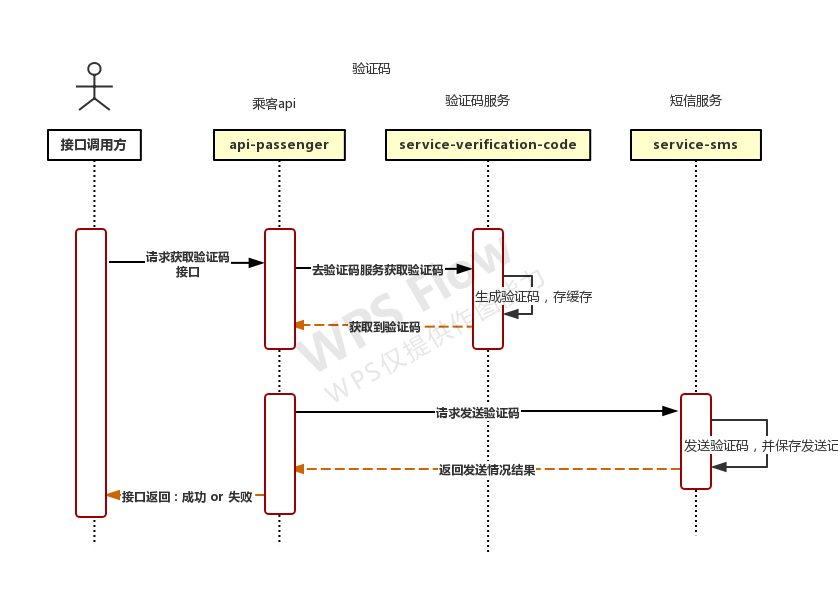
</details>

<details>
<summary><strong>Driver Workflow</strong></summary>

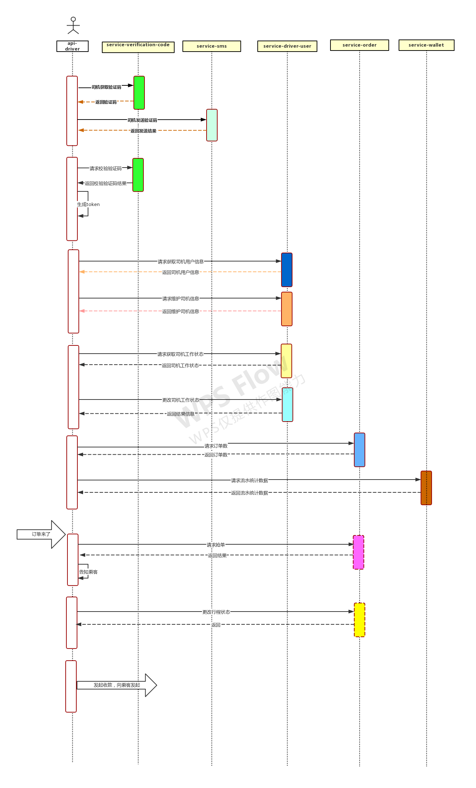
</details>

<details>
<summary><strong>Passenger Order Flow</strong></summary>

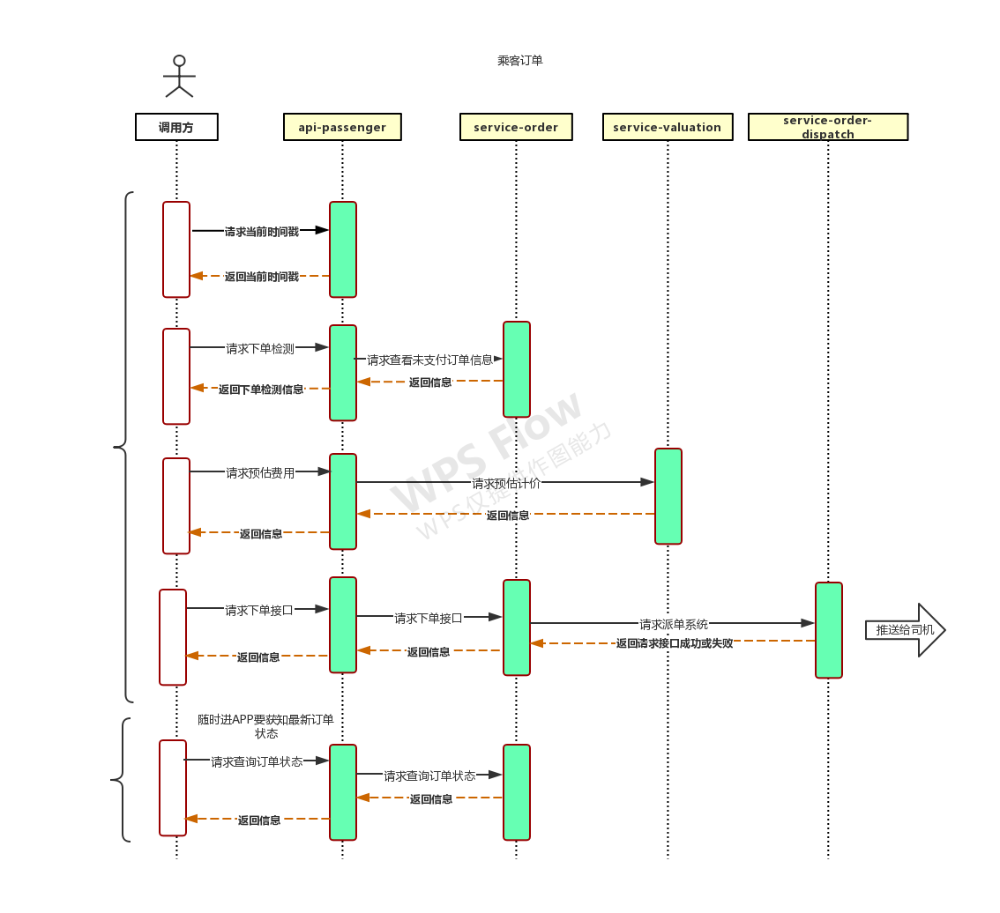
</details>

<details>
<summary><strong>Profile Update</strong></summary>


</details>

<details>
<summary><strong>Address Management</strong></summary>

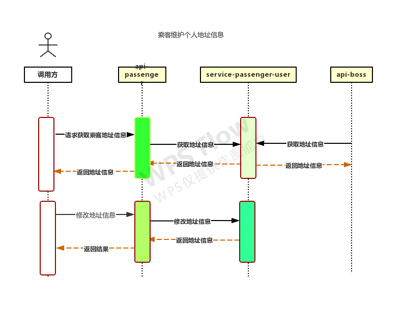
</details>

## Demo Screenshots

<details>
<summary><strong>Click to view order lifecycle screenshots</strong></summary>

### Dispatch & Accept Order
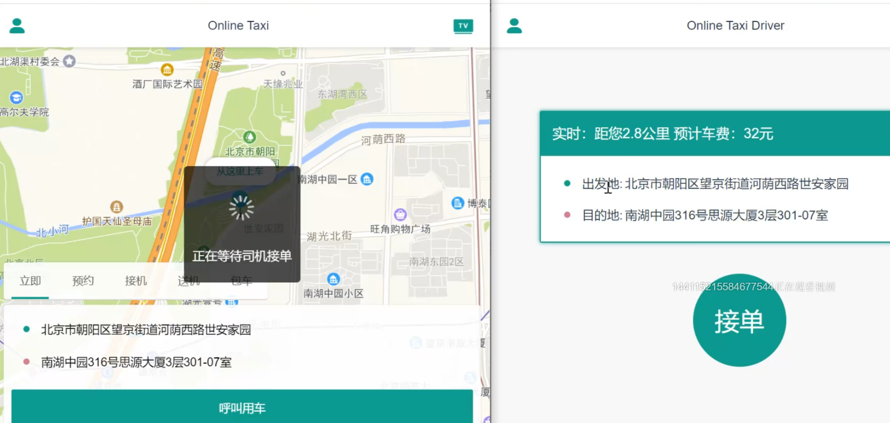

### Arriving at Pickup Location
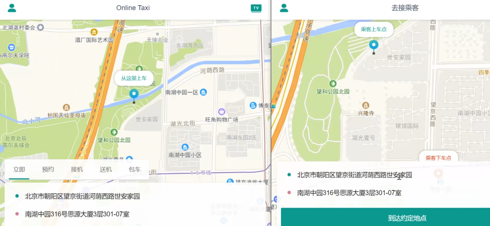

### Passenger Picked Up
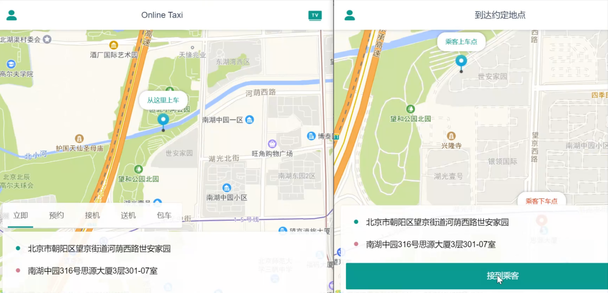

### Journey Started
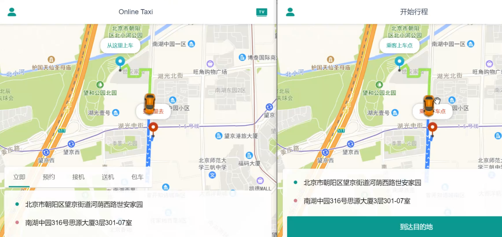

### Destination Reached
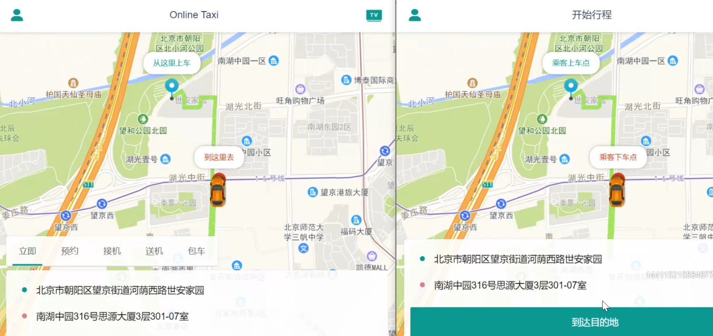

### Payment Initiated
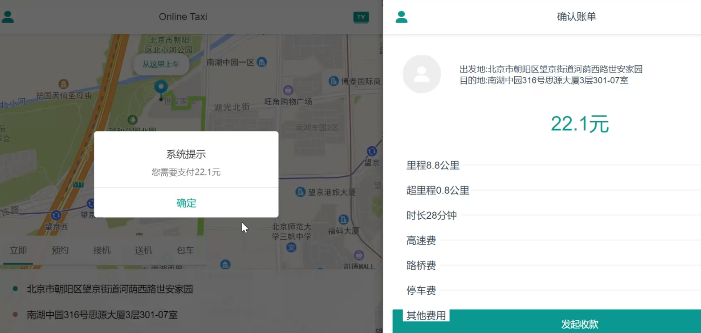

### Payment Received
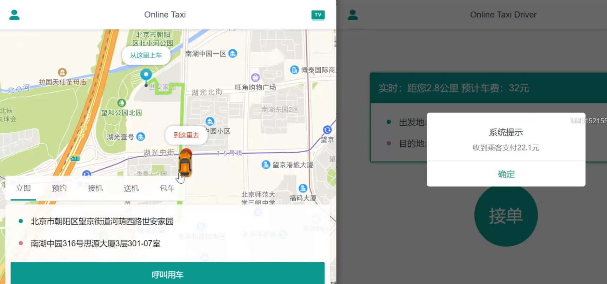

</details>

## Security Notes

- All sensitive credentials are externalized via environment variables
- Never commit `.env` files or any file containing real credentials
- The JWT secret **must** be changed from the default in production
- Eureka endpoints are protected with basic authentication
- Review `management.endpoints.web.exposure` settings before deploying to production
- See [`.env.example`](.env.example) for the complete list of security-related variables

## Contributing

Contributions are welcome! Please read the [Contributing Guide](CONTRIBUTING.md) before submitting a pull request.

## License

This project is licensed under the [MIT License](LICENSE).
